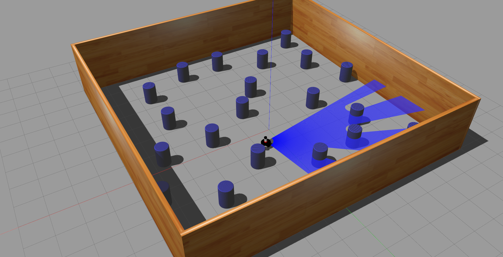

# RL_ROS_Robots - Simulator

This project demonstrates a reinforcement learning approach using ROS2 and Gazebo for simulating and training robots to avoid obstacles. Robot A and Robot B train separately with different starting conditions, and their knowledge is combined to evaluate if cooperative learning improves the performance.


<table>
  <tr>
    <td></td>
    <td></td>
  </tr>
</table>

Before you start, ensure you have the following installed:

- ROS2 Humble
- Python 3.x
- PyTorch
- Gazebo 11
- RViz


# Running the Simulation in Gazebo

### Step 1: Learning Phase

#### 1.1 Robot A

Robot A will start from a fixed point on the map 50 times and collect data while learning to avoid obstacles.

Launch the learning script for Robot A:
   ```bash
   ./run_learn_a_env.sh
   ```
Robot B will start from a fixed point (but different from Robot A) on the map 50 times and collect data while learning to avoid obstacles.

#### 1.2 Robot B

Launch the learning script for Robot A:
   ```bash
   ./run_learn_b_env.sh
   ```

### Step 2: Training Phase

#### 2.1 Robot A

Use the collected data to train the DQN model for Robot A.

   ```bash
   ./run_dqn_train_a.sh
   ```

#### 2.2 Robot B

Use the collected data to train the DQN model for Robot B.

   ```bash
   ./run_dqn_train_b.sh
   ```

#### 2.3 Robot C

Combine the knowledge of Robot A and Robot B to train the DQN model for Robot C.

   ```bash
   ./run_dqn_train_c.sh
   ```

### Step 3: Testing Phase

#### The simulation time after each test run is saved to a `simulation_duration_x.txt`.

#### 3.1 Robot A

Test the trained DQN model for Robot A

   ```bash
   ./run_test_a_env.sh
   ```

#### 3.2 Robot B

Test the trained DQN model for Robot B

   ```bash
   ./run_test_b_env.sh
   ```

#### 3.3 Robot C

Test the combined DQN model for Robot C (using the knowledge from Robots A and B).

   ```bash
   ./run_test_c_env.sh
   ```

